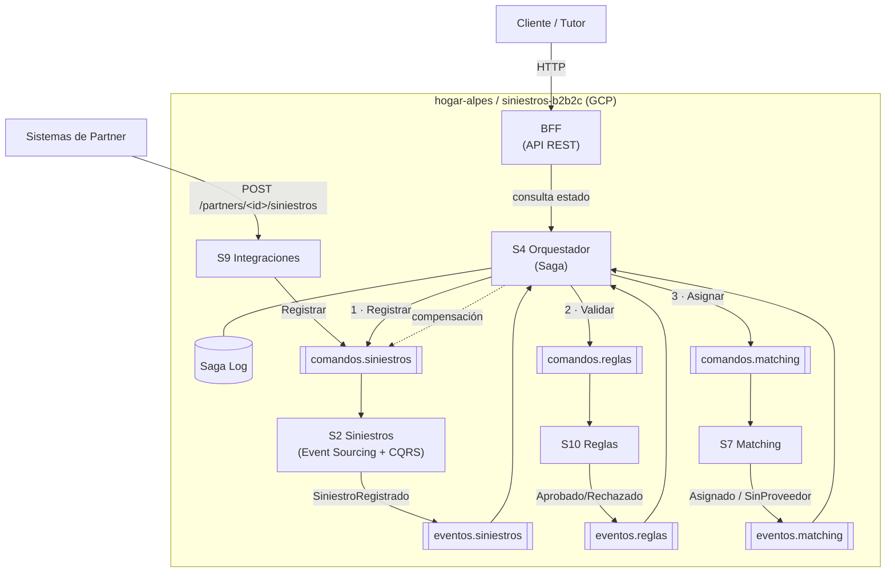
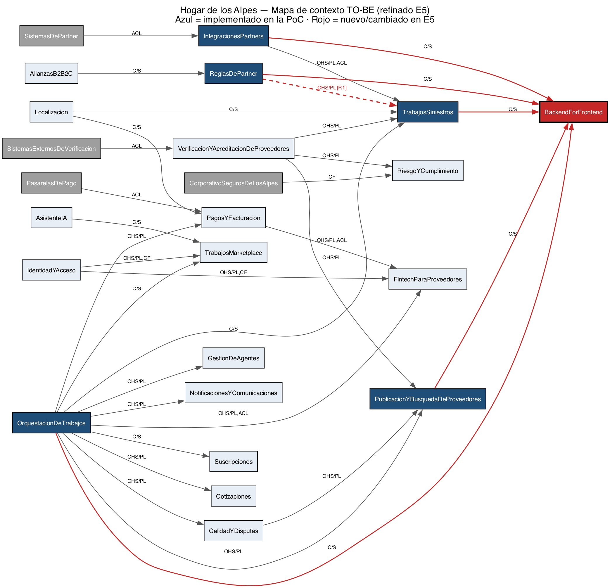

# Hogar de los Alpes — POC de arquitectura basada en eventos (Entrega 5, final)

Prueba de concepto de la migración del monolito **Hogar de los Alpes** a una
arquitectura de microservicios dirigida por eventos. Implementa la **transacción
larga** *"atender un siniestro B2B2C"* (el 70 % del volumen del negocio) como una
**saga orquestada** sobre seis servicios que **se comunican por comandos y eventos
en Apache Pulsar** — cero HTTP/gRPC entre servicios; el HTTP síncrono es solo para
consultas y para la entrada por el **BFF**.

> **Alcance de la Entrega 5.** Cierra la transacción: el **orquestador S4** ejecuta
> la saga `RegistrarSiniestro → ValidarSiniestro → AsignarProveedor` con sus
> compensaciones y un **Saga Log**; se agrega el **BFF**; todo se **despliega en
> GCP**; y se **ejecutan y miden** los tres escenarios de calidad (resultados y
> conclusiones más abajo).

## Enlaces de la entrega

| Recurso | Enlace |
|---|---|
| Repositorio (público, sin credenciales) | https://github.com/MISW-4406-No-monoliticas-entregas/hogar-alpes |
| Despliegue — BFF (punto de entrada) | http://35.184.183.171:8004 |
| Despliegue — Orquestador / Saga | http://35.184.183.171:8005 |
| Colección Postman (BFF + saga E2E) | [`postman/hogar-alpes-e2e.postman_collection.json`](postman/hogar-alpes-e2e.postman_collection.json) |
| Documentación del BFF | [`src/bff/README.md`](src/bff/README.md) |
| Diagramas refinados (E5) | [`docs/diagramas/E5-diagramas-refinados.md`](docs/diagramas/E5-diagramas-refinados.md) · [`hogar-de-los-alpes-to-be-e5.cml`](hogar-de-los-alpes-to-be-e5.cml) |

> El despliegue corre en una VM de GCP que puede estar apagada para ahorrar
> créditos; la IP puede cambiar si se recrea. Si un enlace no responde, se levanta
> en ~1 minuto. Todo se puede correr también en local (ver más abajo).

## Atributos de calidad, escenarios y resultados de la experimentación

Se valida **un escenario por cada atributo de calidad** priorizado. Los tres se
**ejecutaron y midieron** con Locust (carga) y consultas SQL/`pulsar-admin`
(evidencia). Los scripts están en [`experimentos/`](experimentos/) y las notas de
las corridas en [`experimentos/resultados/NOTAS-RESULTADOS.md`](experimentos/resultados/NOTAS-RESULTADOS.md).

| # | Atributo | Escenario (relevante al negocio) | Hipótesis | Resultado / conclusión |
|---|---|---|---|---|
| 1 | **Escalabilidad** | Pico 4× de siniestros de partners (evento climático) | Escala sin tocar código y sin pérdida | **Parcial:** la ingesta acepta 4× con **0 % de pérdida** y p99 acotado (≤ 630 ms). El **consumo** no escaló por el servidor de desarrollo de Flask (single-thread) y el listado por partner sin paginar. Refinamientos: WSGI multi-worker, paginación, separar la lectura. |
| 6 | **Modificabilidad** | Evolución retrocompatible de un esquema Avro | v2 aditivo sin redesplegar consumidores | **Se cumple:** namespace `BACKWARD`; v2 (campo con default) aceptado (v0→v1); esquema incompatible **rechazado (HTTP 409)**; **0 redespliegues**. |
| 7 | **Disponibilidad** | Cae un nodo (réplica/broker) con carga activa | 0 pérdida y 0 sagas huérfanas | **Se cumple:** al tumbar un broker con 40 sagas en vuelo, **40/40 terminales, 0 huérfanas**, sin pérdida y con recuperación automática. Verificado también sobre el cluster real de GCP. |

La técnica que sostiene la disponibilidad es el trío **`Key_Shared` + `ack` tras el
commit de BD + idempotencia** por `id` de mensaje: Pulsar reentrega lo no
confirmado al nodo vivo sin duplicar efectos.

### Pruebas no-determinísticas asistidas por IA (valor agregado)

Además de los tres escenarios, se montaron pruebas donde un agente genera entradas
aleatorias y actúa como oráculo verificando **invariantes de dominio**
(terminalidad, no-pérdida, coherencia del desenlace, integridad) en vez de valores
exactos. Sobre 40+ sagas los invariantes se cumplen, y la generación
no-determinística **encontró dos defectos de robustez** que la suite determinista y
la colección Postman (100 % en verde) no exponen: un `monto` negativo deja la saga
huérfana (falta la regla `monto > 0` en el borde) y un `monto` no numérico produce
un 500. Detalle, reproducción y harness en
[`experimentos/pruebas_ia/`](experimentos/pruebas_ia/).

## La transacción larga: saga orquestada

El **orquestador S4** coordina la saga y registra cada paso en su **Saga Log**. El
**BFF** es la entrada síncrona. La secuencia es
`RegistrarSiniestro → ValidarSiniestro → AsignarProveedor`; si no hay proveedor, S4
ejecuta la **compensación**.



| Servicio | Rol | BD | Patrón de datos |
|---|---|---|---|
| **BFF** | API REST de agregación (entrada síncrona); sin lógica de dominio | — (sin BD) | Backend for Frontend |
| **S4 Orquestador** | Coordina la saga y mantiene el Saga Log | `orquestador` (`saga_log`) | Saga (orquestación) |
| **S9 Integraciones** | ACL de entrada: traduce el siniestro del partner; idempotencia por `partner_id + id_externo` | `integraciones` | CRUD |
| **S2 Siniestros** | Dueño del agregado `Siniestro` y su ciclo de vida | `siniestros` (event store + proyección) | **Event Sourcing + CQRS** |
| **S10 Reglas** | Evalúa reglas del partner (monto, cobertura, zona) | `reglas` | CRUD |
| **S7 Matching** | Busca y reserva un proveedor habilitado | `matching` | CRUD |

Cada servicio tiene **su propio PostgreSQL**; ninguno conoce la base de otro.
La saga se arranca con `POST /sagas` en el orquestador (o consultando el estado por
el BFF en `/siniestros/<id>/estado`).

## Contrato de tópicos y esquemas

Todos viven bajo `persistent://hogar-alpes/siniestros-b2b2c/<nombre>` y llegan a
cada servicio **por variable de entorno**, nunca escritos a mano en el código.
Los crea el script [`infra/pulsar/crear_topicos.sh`](infra/pulsar/crear_topicos.sh)
(que corre el contenedor efímero `pulsar-init`).

| Tópico | Particiones | Mensajes | Publica | Consume |
|---|---|---|---|---|
| `comandos.siniestros` | **4** | RegistrarSiniestro, MarcarValidado, AsignarProveedor, RechazarSiniestro | S9 (saga en E5) | S2 |
| `eventos.siniestros` | **4** | SiniestroRegistrado, SiniestroValidado, ProveedorAsignado, SiniestroRechazado | S2 | S4 (saga), S10, S7 |
| `comandos.reglas` | 1 | ValidarSiniestro | saga (E5); en E4 a mano | S10 |
| `eventos.reglas` | 1 | SiniestroAprobadoPorReglas, SiniestroRechazadoPorReglas | S10 | saga (E5) |
| `comandos.matching` | 1 | AsignarProveedor, LiberarProveedor | saga (E5); en E4 a mano | S7 |
| `eventos.matching` | 1 | ProveedorAsignado, SinProveedorDisponible | S7 | saga (E5) |
| `eventos.partners` | 1 | SiniestroSincronizado | S9 | — |

`comandos.siniestros` y `eventos.siniestros` van **particionados a 4** porque son
los que reciben el pico 4× (PS-01); la llave de partición es el `id` del siniestro
(orden por siniestro, paralelismo entre siniestros). El resto son de bajo volumen.

**El sobre de todo mensaje** vive en `seedwork/infraestructura/schema/v1/mensajes.py`
y no se toca: `id`, `time`, `spec_version`, `type` y `data`. El campo `type`
permite que varios tipos de evento viajen por el mismo tópico y que el consumidor
sepa a qué handler despacharlos.

## Decisiones de arquitectura

### Tipo de eventos: con carga de estado (*state-carrying*)

Los eventos llevan **los datos del agregado** (id, partner, póliza, dirección,
monto, estado, versión…), no solo el identificador. Razón: como **no se permiten
llamados síncronos** entre servicios, un consumidor que recibe solo un `id` no
tiene cómo "ir a preguntar" por el resto; y así cada servicio mantiene su propio
modelo de lectura y absorbe la carga localmente (AC-1 escalabilidad, AC-3
disponibilidad). El tradeoff (TO-01) es acoplamiento al esquema, que se mitiga con
el versionamiento. Los **comandos** también llevan el payload completo (son la
intención de un actor sobre un agregado).

> Distinción: los eventos de dominio *internos* de S2 (entre `siniestros` y
> `seguimiento`) son eventos de dominio **en memoria**; los que salen por Pulsar
> son eventos de **integración con carga de estado**.

### Esquemas: Avro + schema registry de Pulsar + versionamiento de stream

- **Avro** porque el cliente Python de Pulsar trae `AvroSchema` nativo y el
  **schema registry viene integrado en el broker** (sin componente externo); la
  evolución por **valores por defecto** es el mecanismo estándar y hace posible el
  escenario 6; y es lo que usa el curso. Protobuf se descartó (su ventaja es gRPC
  y multi-lenguaje, y aquí no hay gRPC y todo es Python); JSON plano, por no tener
  contrato ni evolución controlada.
- **Política `BACKWARD`** en el namespace: un consumidor con el esquema nuevo lee
  mensajes viejos. Con `set-is-allow-auto-update-schema` el registry acepta la v2
  aditiva; un productor con un esquema **incompatible** es rechazado por el broker
  (demo en vivo del escenario 6).
- **Versionamiento de stream:** cambios **aditivos** (campo nuevo con default) →
  nueva versión del esquema en el **mismo tópico** (`v1` → `v1.1`). Cambios
  **incompatibles** (quitar/renombrar/cambiar tipo) → **no** sobre el mismo
  stream: se crea `eventos.siniestros.v2`, se publica en ambos durante la
  transición (*dual publish*) y se migran los consumidores a su ritmo. Código en
  `infraestructura/schema/v1/` (y `v2/`) por servicio.
- **Dueño del esquema:** cada servicio es dueño de los esquemas de los tópicos que
  **publica** y de los comandos que **consume**. El otro lado **copia** el esquema
  (Published Language); nunca se importa código entre servicios (PS-05).

### Almacenamiento: topología descentralizada + híbrido CRUD / Event Sourcing

- **Descentralizada (database per service).** Cuatro instancias PostgreSQL, una
  por servicio, con credenciales propias. Los modelos de lectura que un servicio
  necesita (p. ej. `proveedores_habilitados` en S7) se construyen **a partir de
  eventos**, no leyendo la BD ajena. Es la traducción directa de los bounded
  contexts (PS-08). La BD compartida fue el anti-patrón del AS-IS (equipos
  bloqueados, despliegues de 3–4 h). Beneficia AC-2 (cada equipo cambia su esquema
  sin coordinar), AC-1 (cada BD escala según su carga) y AC-3 (una BD caída no
  tumba a las demás). Tradeoff aceptado: consistencia eventual y duplicación de
  datos (TO-01).
- **Event Sourcing en S2**, CRUD en S9/S10/S7. El siniestro tiene consecuencias
  contractuales (SLA, disputas) → necesita **auditoría completa**; reconstruir el
  agregado desde sus eventos la da gratis y hace natural la proyección
  `estado_siniestro` (CQRS); el event store es *append-only* → escala la escritura
  bajo el pico (escenarios 1 y 7). Los otros tres son configuración/registros sin
  historia: ES ahí sería complejidad sin beneficio. Tener ambos patrones en el POC
  demuestra que **cada equipo elige el suyo** (autonomía = AC-2).
- Que S2 tenga dos tablas (event store + proyección) en su propia base **no**
  rompe la descentralización: es un solo dueño con separación escritura/lectura.

### Seedwork copiado, no compartido

Cada servicio lleva **su copia** del `seedwork`. Es deliberado (PS-05): una
librería compartida que evoluciona obliga a redesplegar los cuatro servicios — el
Shared Kernel disfrazado del AS-IS. En un monorepo la copia cuesta poco y cada
servicio queda desplegable solo.

### Patrón obligatorio de todo consumidor

Resuelto en `src/_plantilla/` y replicado en los 4 servicios: suscripción
**`Key_Shared`** con nombre por servicio (`sub-siniestros`, `sub-reglas`…), llave
de partición = `id` del siniestro, **`ack` después** de confirmar la transacción
de BD (*at-least-once*), `negative_acknowledge` en error e **idempotencia por `id`
de mensaje**. Ese trío (Key_Shared + ack tardío + idempotencia) es la respuesta
técnica al escenario 7.

## Cómo levantar el POC en local

Requiere Docker y Docker Compose. Un solo comando levanta Pulsar standalone, las
4 bases y los servicios; los tópicos los crea `pulsar-init` sin pasos manuales:

```bash
git clone https://github.com/MISW-4406-No-monoliticas-entregas/hogar-alpes.git
cd hogar-alpes
docker compose up --build
```

| Servicio | URL local | Puerto Postgres |
|---|---|---|
| S9 Integraciones | http://localhost:8001 | 5434 |
| S2 Siniestros | http://localhost:8000 | 5433 |
| S10 Reglas | http://localhost:8002 | 5435 |
| S7 Matching | http://localhost:8003 | 5436 |
| **BFF** (interfaz síncrona hacia afuera) | http://localhost:8004 | — (sin BD) |
| **S4 Orquestador** (saga + Saga Log) | http://localhost:8005 | 5437 |
| Pulsar (binario / admin) | `pulsar://localhost:6650` / http://localhost:8080 | — |

### Flujo de aceptación de punta a punta

```bash
# 1. El partner envía un siniestro en SU formato -> S9 lo traduce y publica el comando
#    (Seguros Alpes usa numeroReclamo + montoEstimado + dirección estructurada)
curl -X POST http://localhost:8001/partners/seguros-alpes/siniestros \
  -H "Content-Type: application/json" \
  -d '{"numeroReclamo":"SA-1001","poliza":"POL-123","montoEstimado":500000,
       "moneda":"COP","direccion":{"calle":"Cra 7 # 1-2","ciudad":"Bogota","pais":"CO"}}'
# La respuesta 202 trae el id_sincronizacion. Otro partner con OTRO formato:
#   curl -X POST http://localhost:8001/partners/banco-andes/siniestros -H "Content-Type: application/json" \
#     -d '{"ref":"BA-778","policy_number":"POL-12","amount":{"value":1200000,"currency":"COP"},"address":"Calle 1 # 2-3, Bogota, CO"}'

# 2. El comando viaja por comandos.siniestros -> S2 lo procesa -> event store + proyección
curl http://localhost:8000/siniestros/<id_siniestro>

# 3. Observar el evento de integración publicado por S2
docker compose exec pulsar bin/pulsar-client consume \
  persistent://hogar-alpes/siniestros-b2b2c/eventos.siniestros -s demo -n 0
```

## Probar S7 Matching manualmente (legado / diagnóstico)

En la Entrega 5 la **saga (S4)** ya publica `comandos.matching`; esta sección es
para probar S7 de forma aislada. El servicio siembra `proveedores_habilitados` al
arrancar con proveedores en varias zonas/servicios (zonas `bogota-norte`,
`bogota-centro`, `medellin`…), algunos disponibles y otros no
(ver `src/matching/modulos/matching/infraestructura/semilla.py`), para demostrar
los dos desenlaces. Ajusta el `servicio`/`zona` de los ejemplos a los del catálogo
sembrado.

```bash
docker compose up --build -d matching
```

### 1. Caso con cobertura → `ProveedorAsignado`

`plomeria` + `norte` tiene un proveedor sembrado disponible:

```bash
docker compose exec matching python scripts/publicar_prueba.py \
  asignar siniestro-demo-1 plomeria norte
```

### 2. Caso sin cobertura → `SinProveedorDisponible`

`vidrieria` + `norte` solo tiene un proveedor sembrado **no disponible**:

```bash
docker compose exec matching python scripts/publicar_prueba.py \
  asignar siniestro-demo-2 vidrieria norte
```

### 3. Verificar el resultado

```bash
# La asignación quedó ASIGNADA (o SIN_PROVEEDOR) y con fechas.
docker compose exec postgres-matching psql -U matching -d matching \
  -c "select id_siniestro, servicio, zona, proveedor_id, estado from asignaciones;"

# El proveedor usado quedó disponible=false.
docker compose exec postgres-matching psql -U matching -d matching \
  -c "select nombre, servicio, zona, disponible from proveedores_habilitados;"

# El evento de integración publicado por S7 (verás ProveedorAsignado y
# SinProveedorDisponible, uno por cada comando de arriba).
docker compose exec pulsar bin/pulsar-client consume \
  persistent://hogar-alpes/siniestros-b2b2c/eventos.matching -s demo -n 0
```

### 4. Compensación (a mano, sin saga todavía)

```bash
# Usa el proveedor_id que quedó ocupado en el paso 1 (columna `id` de
# proveedores_habilitados para esa fila, o `proveedor_id` en asignaciones).
docker compose exec matching python scripts/publicar_prueba.py \
  liberar siniestro-demo-1 <proveedor_id>

# El proveedor vuelve a disponible=true; no se publica evento (fuera del
# contrato de esta entrega).
docker compose exec postgres-matching psql -U matching -d matching \
  -c "select nombre, disponible from proveedores_habilitados where id='<proveedor_id>';"
```

### 5. GET de consulta y suscripción de solo-log

```bash
curl "http://localhost:8003/proveedores?zona=norte&servicio=plomeria"

# S7 solo loguea lo que le llega de S2, sin lógica de negocio todavía.
docker compose logs -f matching | grep "eventos.siniestros"
```

## BFF: probar el sistema por HTTP desde afuera

El `docker compose up` también levanta el BFF en `http://localhost:8004`. Todo
el flujo anterior se puede hacer contra él (es lo que usaría un sistema externo
o un frontend), sin conocer los puertos de cada servicio:

```bash
# Registrar (el BFF reenvía a S9; S9 publica RegistrarSiniestro en comandos.siniestros)
curl -X POST http://localhost:8004/siniestros -H "Content-Type: application/json" \
  -d '{"partner_id":"seguros-alpes","siniestro":{"numeroReclamo":"SA-1001","poliza":"POL-123",
       "montoEstimado":500000,"moneda":"COP","direccion":{"calle":"Cra 7 # 1-2","ciudad":"Bogota","pais":"CO"}}}'
curl http://localhost:8004/partners/seguros-alpes/siniestros      # -> S2 (ubicar por póliza)
curl http://localhost:8004/siniestros/<id_siniestro>              # -> S2 (detalle)
curl http://localhost:8004/siniestros/<id_siniestro>/estado       # -> Saga Log del orquestador S4
curl http://localhost:8004/reglas/seguros-alpes                   # -> S10
curl "http://localhost:8004/proveedores?zona=bogota-norte&servicio=plomeria"   # -> S7
```

**Arrancar la saga** (transacción larga) en el orquestador S4:

```bash
# Camino feliz (hay proveedor) -> termina COMPLETADA
curl -X POST http://localhost:8005/sagas -H "Content-Type: application/json" \
  -d '{"partner_id":"seguros-alpes","poliza":"POL-1","monto":500000,"servicio":"plomeria","zona":"bogota-norte"}'
# Sin cobertura (no hay proveedor) -> termina COMPENSADA
curl -X POST http://localhost:8005/sagas -H "Content-Type: application/json" \
  -d '{"partner_id":"seguros-alpes","poliza":"POL-2","monto":500000,"servicio":"carpinteria","zona":"bogota-norte"}'

# Ver el Saga Log (estado de cada transacción larga)
curl http://localhost:8005/sagas
```

La colección Postman [`postman/hogar-alpes-e2e`](postman/hogar-alpes-e2e.postman_collection.json)
ejercita todo el flujo (BFF + saga) y usa una variable `{{host}}` para apuntar al
despliegue remoto o a local. Detalle del BFF en [`src/bff/README.md`](src/bff/README.md).

## Cluster de Pulsar y despliegue en GCP

Para correr sobre un cluster real de Pulsar (en vez de standalone) está
`docker-compose.cluster.yml`: ZooKeeper + 2 bookies + 2 brokers (replicación
`ensemble/write/ack = 2`) + los 5 PostgreSQL + los 6 servicios. Dos brokers y dos
bookies permiten tumbar un broker (escenario 7) y escalar réplicas de S2.

```bash
docker compose -f docker-compose.cluster.yml up --build
```

**Despliegue en GCP.** El sistema está desplegado en una VM de Google Compute
Engine con ese cluster. Los scripts están en [`infra/gcp/`](infra/gcp/):

```bash
export GCP_PROJECT=<tu-proyecto>
bash infra/gcp/crear_vm.sh     # crea firewall (8000-8005, 8080/81) + VM con Docker
bash infra/gcp/desplegar.sh    # clona el repo en la VM y levanta el cluster
```

Se eligió una **VM con cluster** y no Cloud Run/GKE porque los consumidores de
Pulsar son procesos **siempre encendidos** (Cloud Run escala a cero) y GKE era el
mayor riesgo operativo; la VM permite además tumbar un broker para el escenario de
disponibilidad. En producción el destino es GKE + Pulsar multi-zona. Las
credenciales van por variables de entorno (ver `.env.example`); **cero credenciales
en el repo**.

## Refinamiento de diagramas (E5)

Con base en los resultados de la experimentación se refinaron los diagramas de las
entregas anteriores (ver [`docs/diagramas/E5-diagramas-refinados.md`](docs/diagramas/E5-diagramas-refinados.md)):

- **Mapa de contexto TO-BE** (Context Mapper, [`hogar-de-los-alpes-to-be-e5.cml`](hogar-de-los-alpes-to-be-e5.cml)):
  [R1] Reglas→Siniestros pasa de síncrono a eventos OHS/PL (justificado por la
  disponibilidad de E3); [R2] se agrega el BFF; [R3] se valida la saga con Saga Log.



- **Puntos de vista** (despliegue y procesos/saga) en Mermaid dentro del mismo
  documento, con la justificación de cada cambio.

## Estructura del repositorio

```
hogar-alpes/
├── README.md                     este archivo (arquitectura, decisiones, escenarios)
├── docker-compose.yml            local: pulsar standalone + 5 postgres + 6 servicios
├── docker-compose.cluster.yml    cluster: zk + 2 bookies + 2 brokers + init + 4 postgres + servicios
├── infra/
│   ├── pulsar/crear_topicos.sh   tenant, namespace, tópicos particionados, BACKWARD, retención
│   └── postman/                  colección de demo (POST a S9, GETs a S2/S7/S10)
├── postman/                      colección E2E (BFF + saga S4) con variable {{host}}; la del BFF en src/bff/postman/
├── experimentos/                 carga Locust (E1/E3), pruebas IA (invariantes), resultados
├── infra/gcp/                    scripts de despliegue en GCP (crear_vm.sh, desplegar.sh)
├── docs/diagramas/               diagramas refinados de E5 (CML + imágenes + Mermaid)
├── hogar-de-los-alpes-to-be-e5.cml   mapa de contexto TO-BE refinado (Context Mapper)
└── src/
    ├── siniestros/               S2 — Event Sourcing + CQRS
    ├── integraciones/            S9 — CRUD, ACL por partner
    ├── reglas/                   S10 — CRUD
    ├── matching/                 S7 — CRUD
    ├── orquestador/              S4 — saga + Saga Log
    ├── bff/                      BFF — REST hacia afuera; único autorizado a hacer HTTP a S9/S2/S10/S7/S4
    └── _plantilla/               servicio de referencia
```

Cada `src/<servicio>/` repite la estructura de los tutoriales 3/5/7 (`api/`,
`config/`, `seedwork/` propio, `modulos/<modulo>/{dominio,aplicacion,infraestructura}`,
`Dockerfile`, `tests/`). Ver el README de cada servicio para el detalle.

## Reglas que no se negocian

- Ningún servicio importa código de otro ni le hace HTTP. Cada servicio conoce
  solo la URL de Pulsar y su propia BD. (Se verifica con `grep` antes de entregar.)
- HTTP **solo** para consultas `GET` dentro de cada servicio y para la entrada
  externa del partner en S9.
- **Única excepción: el BFF** (`src/bff/`). Es la interfaz síncrona hacia
  afuera y la única pieza autorizada a hacerle HTTP a los servicios: registra
  **a través de S9** (no publica comandos), consulta S2/S10/S7 directo para el
  dato propio de cada uno, y el estado de la transacción larga se lo pide al
  **Saga Log del orquestador (S4)**, nunca lo arma combinando servicios. Ver
  [`src/bff/README.md`](src/bff/README.md).
- El dominio no importa Flask, SQLAlchemy ni pulsar. Puertos en dominio y
  aplicación; adaptadores en infraestructura y api.
- Todo en español; eventos en participio pasado, comandos en imperativo.
- Sin credenciales en el repo; sin `.env` reales; sin sobre-ingeniería
  (autenticación, snapshots, pagos y SLA reales quedan fuera del alcance).

## Contribuciones (Entrega 5)

| Miembro | Entregable de E5 |
|---|---|
| **A · Luis** | Despliegue en GCP, experimentación (3 escenarios) y pruebas con IA, refinamiento de diagramas (CML + vistas) y actualización de este README |
| **B · Sara** | **BFF** (servicio de agregación) y colección Postman |
| **C · Jesus** | **S4 Orquestador** — camino feliz de la saga |
| **D · German** | **S4 Orquestador** — compensación y **Saga Log** |

Las contribuciones son visibles en los commits y pull requests de cada rama. La
base de E4 (S2/S9/S10/S7, infraestructura, plantilla) sigue funcionando sin
regresión: la colección Postman pasa en verde y la saga usa los cuatro servicios.
