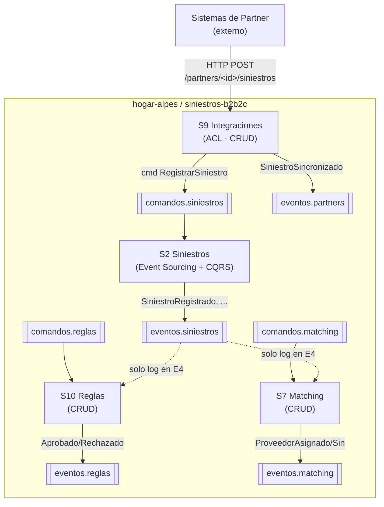

# Hogar de los Alpes — POC de arquitectura basada en eventos (Entrega 4)

Prueba de concepto de la migración del monolito **Hogar de los Alpes** a una
arquitectura de microservicios dirigida por eventos. Implementa los **cuatro
servicios** que participan en la transacción larga *"atender un siniestro
B2B2C"* (el 70 % del volumen del negocio), que **solo se comunican por comandos y
eventos en Apache Pulsar** — cero HTTP/gRPC entre servicios; HTTP solo para las
consultas `GET` de cada servicio y para la entrada externa del partner.

> **Alcance.** En esta entrega los servicios se *oyen* por los tópicos, pero
> todavía no completan la transacción: la saga que los orquesta y el BFF son de
> la Entrega 5. Aquí se deja lista la **infraestructura** que hace demostrables
> los tres escenarios de calidad.

## Atributos de calidad y escenarios probados

Se valida **un escenario por cada atributo de calidad** priorizado. La ejecución
medida es de la Entrega 5; la Entrega 4 deja la infraestructura y el README que
los describe.

| # | Atributo | Escenario | Qué del código lo hace posible | Medida objetivo |
|---|---|---|---|---|
| 1 | **Escalabilidad** | Pico de 4× de siniestros de partners sostenido 48 h por un evento climático | Tópicos particionados (×4), consumidores `Key_Shared` que escalan agregando réplicas **sin tocar código**, event store *append-only* en S2 | p99 de aceptación ≤ 2 s; 0 mensajes perdidos; el throughput crece al agregar réplicas |
| 6 | **Modificabilidad** | Se publica la v2 de un esquema de evento y ningún consumidor se redespliega | `SiniestroRegistrado` v2 con un campo nuevo **con valor por defecto**; política `BACKWARD` en el schema registry de Pulsar | 0 consumidores redesplegados; el registry acepta v2; los consumidores v1 leen mensajes v2 |
| 7 | **Disponibilidad** | Se cae una réplica de S2 Siniestros con carga activa y no se pierde ningún siniestro | `Key_Shared` + `ack` **después** del commit de BD + idempotencia por `id` de mensaje: Pulsar reentrega lo no confirmado | 0 siniestros perdidos; la proyección sigue actualizándose; recuperación < 30 s |

El escenario 3 (consulta CQRS bajo carga) queda como **bonus**: la proyección ya
existe y cuesta poco medirla, pero no es uno de los tres oficiales.

## La transacción larga y los 4 servicios



En la E4, `comandos.reglas` y `comandos.matching` se publican **a mano** (Postman
o script); en la E5 la saga (S4) emite la secuencia
`RegistrarSiniestro → ValidarSiniestro → AsignarProveedor` con sus compensaciones.

| Servicio | Rol | Consume | Publica | BD | Patrón de datos | Dueño |
|---|---|---|---|---|---|---|
| **S9 Integraciones Partners** | ACL de entrada: traduce el siniestro del partner al comando canónico; idempotencia por `partner_id + id_externo` | HTTP del partner (externo) | `comandos.siniestros`, `eventos.partners` | `integraciones` (1 tabla) | CRUD | A · Luis |
| **S2 Trabajos Siniestros** | Dueño del agregado `Siniestro` y su ciclo de vida | `comandos.siniestros` | `eventos.siniestros` | `siniestros` (event store + proyección) | **Event Sourcing + CQRS** | B |
| **S10 Reglas de Partner** | Evalúa reglas del partner (monto, cobertura, zona) | `comandos.reglas`, `eventos.siniestros` (log) | `eventos.reglas` | `reglas` (2 tablas) | CRUD | C |
| **S7 Matching de Proveedores** | Busca y reserva un proveedor habilitado | `comandos.matching`, `eventos.siniestros` (log) | `eventos.matching` | `matching` (2 tablas) | CRUD | D |

Cada servicio tiene **su propio PostgreSQL**; ninguno conoce la base de otro.

## Contrato de tópicos y esquemas

Todos viven bajo `persistent://hogar-alpes/siniestros-b2b2c/<nombre>` y llegan a
cada servicio **por variable de entorno**, nunca escritos a mano en el código.
Los crea el script [`infra/pulsar/crear_topicos.sh`](infra/pulsar/crear_topicos.sh)
(que corre el contenedor efímero `pulsar-init`).

| Tópico | Particiones | Mensajes | Publica | Consume |
|---|---|---|---|---|
| `comandos.siniestros` | **4** | RegistrarSiniestro, MarcarValidado, AsignarProveedor, RechazarSiniestro | S9 (saga en E5) | S2 |
| `eventos.siniestros` | **4** | SiniestroRegistrado, SiniestroValidado, ProveedorAsignado, SiniestroRechazado | S2 | S10, S7 (log en E4) |
| `comandos.reglas` | 1 | ValidarSiniestro | saga (E5); en E4 a mano | S10 |
| `eventos.reglas` | 1 | SiniestroAprobadoPorReglas, SiniestroRechazadoPorReglas | S10 | saga (E5) |
| `comandos.matching` | 1 | AsignarProveedor, LiberarProveedor | saga (E5); en E4 a mano | S7 |
| `eventos.matching` | 1 | ProveedorAsignado, SinProveedorDisponible | S7 | saga (E5) |
| `eventos.partners` | 1 | SiniestroSincronizado | S9 | — |

`comandos.siniestros` y `eventos.siniestros` van **particionados a 4** porque son
los que reciben el pico 4× (PS-01); la llave de partición es el `id` del siniestro
(orden por siniestro, paralelismo entre siniestros). El resto son de bajo volumen.

**El sobre de todo mensaje** vive en `seedwork/infraestructura/schema/v1/mensajes.py`
y no se toca: `id`, `time`, `spec_version`, `type` y `data`. El campo `type`
permite que varios tipos de evento viajen por el mismo tópico y que el consumidor
sepa a qué handler despacharlos.

## Decisiones de arquitectura (para la sustentación)

### Tipo de eventos: con carga de estado (*state-carrying*)

Los eventos llevan **los datos del agregado** (id, partner, póliza, dirección,
monto, estado, versión…), no solo el identificador. Razón: como **no se permiten
llamados síncronos** entre servicios, un consumidor que recibe solo un `id` no
tiene cómo "ir a preguntar" por el resto; y así cada servicio mantiene su propio
modelo de lectura y absorbe la carga localmente (AC-1 escalabilidad, AC-3
disponibilidad). El tradeoff (TO-01) es acoplamiento al esquema, que se mitiga con
el versionamiento. Los **comandos** también llevan el payload completo (son la
intención de un actor sobre un agregado).

> Distinción para la sustentación: los eventos de dominio *internos* de S2 (entre
> `siniestros` y `seguimiento`) son eventos de dominio **en memoria**; los que
> salen por Pulsar son eventos de **integración con carga de estado**.

### Esquemas: Avro + schema registry de Pulsar + versionamiento de stream

- **Avro** porque el cliente Python de Pulsar trae `AvroSchema` nativo y el
  **schema registry viene integrado en el broker** (sin componente externo); la
  evolución por **valores por defecto** es el mecanismo estándar y hace posible el
  escenario 6; y es lo que usa el curso. Protobuf se descartó (su ventaja es gRPC
  y multi-lenguaje, y aquí no hay gRPC y todo es Python); JSON plano, por no tener
  contrato ni evolución controlada.
- **Política `BACKWARD`** en el namespace: un consumidor con el esquema nuevo lee
  mensajes viejos. Con `set-is-allow-auto-update-schema` el registry acepta la v2
  aditiva; un productor con un esquema **incompatible** es rechazado por el broker
  (demo en vivo del escenario 6).
- **Versionamiento de stream:** cambios **aditivos** (campo nuevo con default) →
  nueva versión del esquema en el **mismo tópico** (`v1` → `v1.1`). Cambios
  **incompatibles** (quitar/renombrar/cambiar tipo) → **no** sobre el mismo
  stream: se crea `eventos.siniestros.v2`, se publica en ambos durante la
  transición (*dual publish*) y se migran los consumidores a su ritmo. Código en
  `infraestructura/schema/v1/` (y `v2/`) por servicio.
- **Dueño del esquema:** cada servicio es dueño de los esquemas de los tópicos que
  **publica** y de los comandos que **consume**. El otro lado **copia** el esquema
  (Published Language); nunca se importa código entre servicios (PS-05).

### Almacenamiento: topología descentralizada + híbrido CRUD / Event Sourcing

- **Descentralizada (database per service).** Cuatro instancias PostgreSQL, una
  por servicio, con credenciales propias. Los modelos de lectura que un servicio
  necesita (p. ej. `proveedores_habilitados` en S7) se construyen **a partir de
  eventos**, no leyendo la BD ajena. Es la traducción directa de los bounded
  contexts (PS-08). La BD compartida fue el anti-patrón del AS-IS (equipos
  bloqueados, despliegues de 3–4 h). Beneficia AC-2 (cada equipo cambia su esquema
  sin coordinar), AC-1 (cada BD escala según su carga) y AC-3 (una BD caída no
  tumba a las demás). Tradeoff aceptado: consistencia eventual y duplicación de
  datos (TO-01).
- **Event Sourcing en S2**, CRUD en S9/S10/S7. El siniestro tiene consecuencias
  contractuales (SLA, disputas) → necesita **auditoría completa**; reconstruir el
  agregado desde sus eventos la da gratis y hace natural la proyección
  `estado_siniestro` (CQRS); el event store es *append-only* → escala la escritura
  bajo el pico (escenarios 1 y 7). Los otros tres son configuración/registros sin
  historia: ES ahí sería complejidad sin beneficio. Tener ambos patrones en el POC
  demuestra que **cada equipo elige el suyo** (autonomía = AC-2).
- Que S2 tenga dos tablas (event store + proyección) en su propia base **no**
  rompe la descentralización: es un solo dueño con separación escritura/lectura.

### Seedwork copiado, no compartido

Cada servicio lleva **su copia** del `seedwork`. Es deliberado (PS-05): una
librería compartida que evoluciona obliga a redesplegar los cuatro servicios — el
Shared Kernel disfrazado del AS-IS. En un monorepo la copia cuesta poco y cada
servicio queda desplegable solo.

### Patrón obligatorio de todo consumidor

Resuelto en `src/_plantilla/` y replicado en los 4 servicios: suscripción
**`Key_Shared`** con nombre por servicio (`sub-siniestros`, `sub-reglas`…), llave
de partición = `id` del siniestro, **`ack` después** de confirmar la transacción
de BD (*at-least-once*), `negative_acknowledge` en error e **idempotencia por `id`
de mensaje**. Ese trío (Key_Shared + ack tardío + idempotencia) es la respuesta
técnica al escenario 7.

## Cómo levantar el POC en local

Requiere Docker y Docker Compose. Un solo comando levanta Pulsar standalone, las
4 bases y los servicios; los tópicos los crea `pulsar-init` sin pasos manuales:

```bash
git clone https://github.com/MISW-4406-No-monoliticas-entregas/hogar-alpes.git
cd hogar-alpes
docker compose up --build
```

| Servicio | URL local | Puerto Postgres |
|---|---|---|
| S9 Integraciones | http://localhost:8001 | 5434 |
| S2 Siniestros | http://localhost:8000 | 5433 |
| S10 Reglas | http://localhost:8002 | 5435 |
| S7 Matching | http://localhost:8003 | 5436 |
| Pulsar (binario / admin) | `pulsar://localhost:6650` / http://localhost:8080 | — |

> Los servicios de los compañeros (S10, S7) quedan **comentados** en
> `docker-compose.yml` hasta que sus carpetas existan, para que `docker compose
> up` siempre funcione. Se descomentan al integrar.

### Flujo de aceptación de punta a punta

```bash
# 1. El partner envía un siniestro en SU formato -> S9 lo traduce y publica el comando
#    (Seguros Alpes usa numeroReclamo + montoEstimado + dirección estructurada)
curl -X POST http://localhost:8001/partners/seguros-alpes/siniestros \
  -H "Content-Type: application/json" \
  -d '{"numeroReclamo":"SA-1001","poliza":"POL-123","montoEstimado":500000,
       "moneda":"COP","direccion":{"calle":"Cra 7 # 1-2","ciudad":"Bogota","pais":"CO"}}'
# La respuesta 202 trae el id_sincronizacion. Otro partner con OTRO formato:
#   curl -X POST http://localhost:8001/partners/banco-andes/siniestros -H "Content-Type: application/json" \
#     -d '{"ref":"BA-778","policy_number":"POL-12","amount":{"value":1200000,"currency":"COP"},"address":"Calle 1 # 2-3, Bogota, CO"}'

# 2. El comando viaja por comandos.siniestros -> S2 lo procesa -> event store + proyección
curl http://localhost:8000/siniestros/<id_siniestro>

# 3. Observar el evento de integración publicado por S2
docker compose exec pulsar bin/pulsar-client consume \
  persistent://hogar-alpes/siniestros-b2b2c/eventos.siniestros -s demo -n 0
```

## Cluster de Pulsar

Para probar el sistema sobre un cluster real de Pulsar (en vez de standalone)
está `docker-compose.cluster.yml`: ZooKeeper + 2 bookies + 2 brokers (con
replicación `ensemble/write/ack = 2`) + las 4 bases + los servicios. Dos brokers
y dos bookies permiten en la E5 tumbar un broker (escenario 9) y escalar réplicas
de S2. Las credenciales se pasan por variables de entorno (ver `.env.example`).

```bash
docker compose -f docker-compose.cluster.yml up --build
```

## Estructura del repositorio

```
hogar-alpes/
├── README.md                     este archivo (arquitectura, decisiones, escenarios)
├── docker-compose.yml            local: pulsar standalone + 4 postgres + servicios
├── docker-compose.cluster.yml    cluster: zk + 2 bookies + 2 brokers + init + 4 postgres + servicios
├── infra/
│   ├── pulsar/crear_topicos.sh   tenant, namespace, tópicos particionados, BACKWARD, retención
│   └── postman/                  colección de demo (POST a S9, GETs a S2/S7/S10)
├── docs/                         notas de arquitectura
└── src/
    ├── siniestros/               S2 — Event Sourcing + CQRS
    ├── integraciones/            S9 — CRUD, ACL por partner
    ├── reglas/                   S10 — CRUD (compañero C)
    ├── matching/                 S7 — CRUD (compañero D)
    └── _plantilla/               servicio de referencia que C y D copian
```

Cada `src/<servicio>/` repite la estructura de los tutoriales 3/5/7 (`api/`,
`config/`, `seedwork/` propio, `modulos/<modulo>/{dominio,aplicacion,infraestructura}`,
`Dockerfile`, `tests/`). Ver el README de cada servicio para el detalle.

## Reglas que no se negocian

- Ningún servicio importa código de otro ni le hace HTTP. Cada servicio conoce
  solo la URL de Pulsar y su propia BD. (Se verifica con `grep` antes de entregar.)
- HTTP **solo** para consultas `GET` dentro de cada servicio y para la entrada
  externa del partner en S9.
- El dominio no importa Flask, SQLAlchemy ni pulsar. Puertos en dominio y
  aplicación; adaptadores en infraestructura y api.
- Todo en español; eventos en participio pasado, comandos en imperativo.
- Sin credenciales en el repo; sin `.env` reales; sin sobre-ingeniería
  (autenticación, snapshots, sagas y BFF son de la Entrega 5).

## Actividades por miembro

| Miembro | Servicio / entregable | Rama |
|---|---|---|
| **A · Luis** | Infraestructura (monorepo, `docker-compose`, topología Pulsar, plantilla), **S9 Integraciones**, README de decisiones | `feat/monorepo-infra`, `feat/s9-integraciones` |
| **B** | **S2 Trabajos Siniestros**: consumidor de comandos, Event Sourcing, proyección/reconstrucción, esquemas v1/v2 | `feat/s2-event-sourcing` |
| **C** | **S10 Reglas de Partner** (CRUD sobre la plantilla) | `feat/s10-reglas` |
| **D** | **S7 Matching de Proveedores** (CRUD), colección Postman unificada, documento de actividades | `feat/s7-matching` |

El documento detallado de contribuciones (respaldado por los pull requests) lo
consolida D. Las contribuciones son visibles en los commits y PRs de cada rama.
