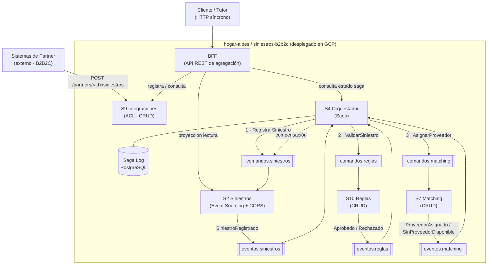
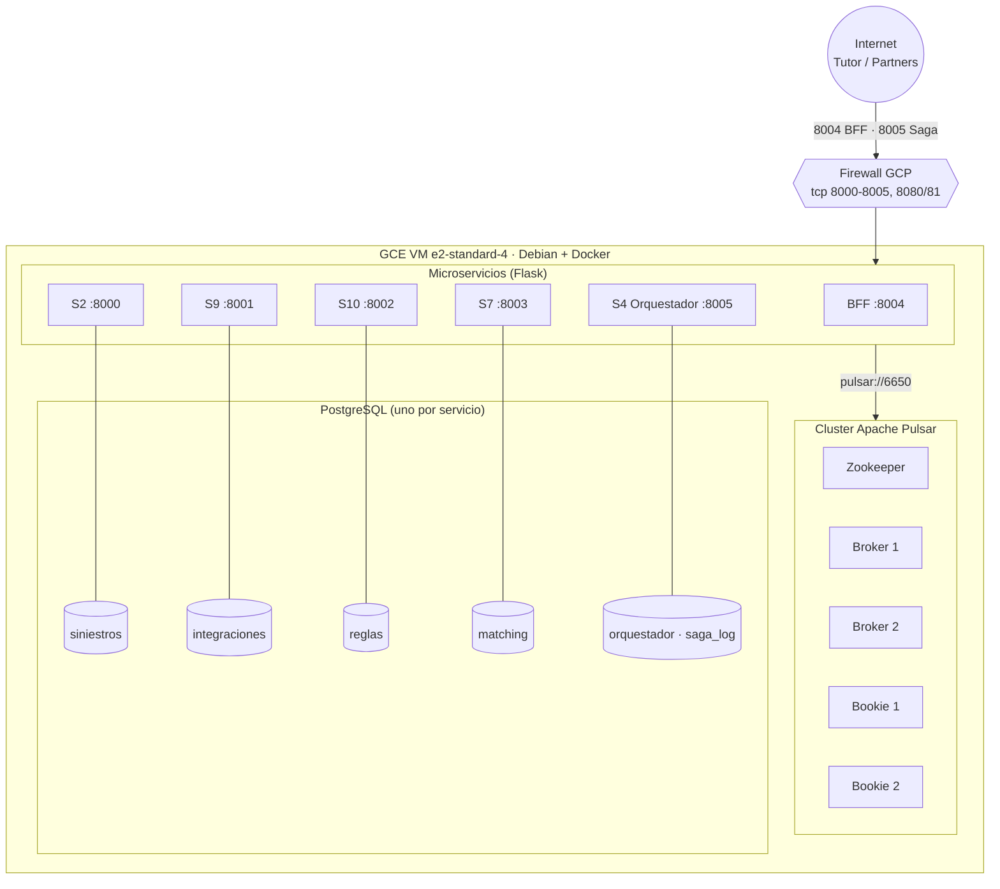
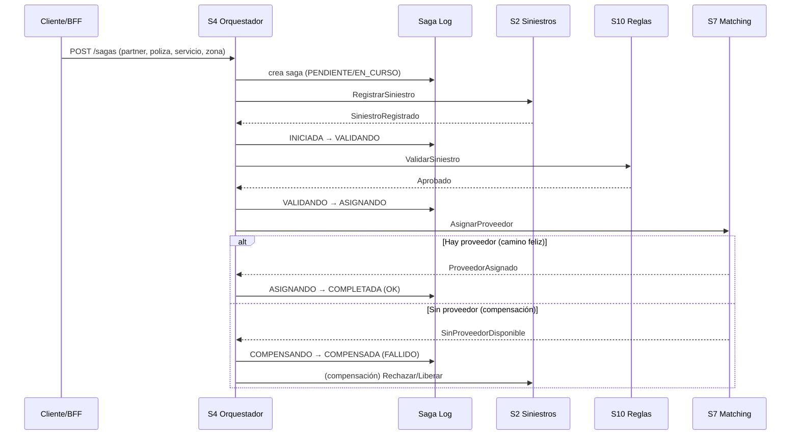

# Diagramas refinados — Entrega 5

Refinamiento de los diagramas de la Entrega 1 (mapa de contexto TO-BE) y la
Entrega 2 (puntos de vista), **con base en los resultados de la experimentación**
de la Entrega 5. Cada diagrama está en Mermaid (lo renderiza GitHub y
[mermaid.live](https://mermaid.live) para capturar/exportar).

---

## 1. Mapa de contexto TO-BE (refinado)

**Qué cambió respecto a la Entrega 1 y por qué:**
- Se agregan dos contextos que introdujo la Entrega 5: el **Orquestador de Sagas
  (S4)** con su **Saga Log**, y el **BFF** como capa de entrada síncrona.
- La comunicación entre S2/S10/S7 deja de ser "solo log" (E4) y pasa a ser una
  **saga orquestada**: S4 coordina los pasos y reacciona a los eventos.
- Justificación (experimentación): la **orquestación** se eligió sobre coreografía
  porque el Saga Log —que E3 usó como evidencia de que no quedan transacciones
  huérfanas— es el rol natural de un orquestador centralizado.

---

## 2. Punto de vista — Despliegue (refinado)

**Qué cambió y por qué:**
- Se reemplaza el diagrama local por el **despliegue real en GCP**: una VM con un
  **cluster Pulsar de verdad** (zookeeper + 2 brokers + 2 bookies), los 6 servicios
  y 5 PostgreSQL.
- Justificación (experimentación): **E3** demostró disponibilidad tumbando un
  **broker** con carga y sin pérdida — eso exige ≥2 brokers, por eso el cluster y
  no un Pulsar standalone.

---

## 3. Punto de vista — Procesos / Saga (refinado)

**Qué cambió y por qué:**
- Se agrega la **transacción larga** (no existía en E2): el flujo orquestado con su
  **camino feliz** y su **camino de compensación**, y el registro en el Saga Log.
- Justificación (experimentación): la máquina de estados
  `INICIADA → VALIDANDO → ASIGNANDO → COMPLETADA` (o `COMPENSANDO → COMPENSADA`) es
  la que E3 y las pruebas con IA verificaron que **siempre llega a un estado
  terminal** (0 huérfanas), incluso al caer un broker.

---

## Cómo exportar para el documento

1. Abrir [mermaid.live](https://mermaid.live), pegar el bloque, **Export → PNG/SVG**.
2. O verlos renderizados en GitHub (este archivo) y capturar pantalla.
