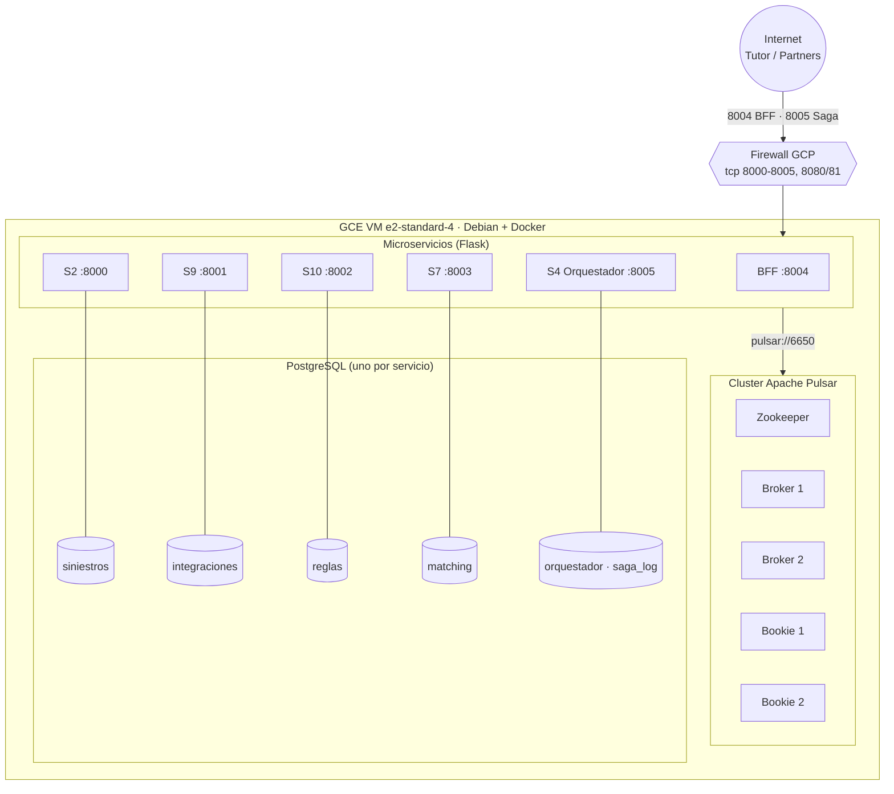
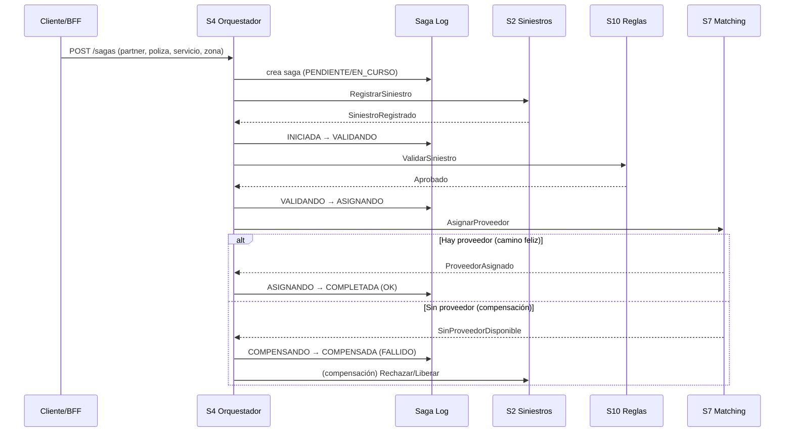

# Diagramas refinados — Entrega 5

Complemento visual de los refinamientos de la Entrega 5.

> **IMPORTANTE — mapa de contexto TO-BE:** el refinamiento del mapa de contexto
> se hizo en **Context Mapper (CML)**, igual que en la Entrega 1. El archivo
> autoritativo es **`hogar-de-los-alpes-to-be-e5.cml`** (en la raíz del repo);
> ábrelo en Context Mapper para regenerar el diagrama. Cambios aplicados (con su
> justificación por la experimentación) documentados en el encabezado del `.cml`:
> **[R1]** Reglas→Siniestros pasa de síncrono a eventos OHS/PL (justificado por la
> disponibilidad de E3); **[R2]** se agrega el BFF como capa de agregación
> síncrona; **[R3]** se valida la saga con Saga Log en OrquestacionDeTrabajos.
>
> Los diagramas de abajo (despliegue y procesos/saga) son **puntos de vista**
> complementarios en Mermaid, renderizables en [mermaid.live](https://mermaid.live).

**Imagen generada del mapa de contexto refinado** (render con Graphviz a partir del `.cml`):

---

## 1. Punto de vista — Despliegue (refinado)

**Qué cambió y por qué:**
- Se reemplaza el diagrama local por el **despliegue real en GCP**: una VM con un
  **cluster Pulsar de verdad** (zookeeper + 2 brokers + 2 bookies), los 6 servicios
  y 5 PostgreSQL.
- Justificación (experimentación): **E3** demostró disponibilidad tumbando un
  **broker** con carga y sin pérdida — eso exige ≥2 brokers, por eso el cluster y
  no un Pulsar standalone.

---

## 2. Punto de vista — Procesos / Saga (refinado)

**Qué cambió y por qué:**
- Se agrega la **transacción larga** (no existía en E2): el flujo orquestado con su
  **camino feliz** y su **camino de compensación**, y el registro en el Saga Log.
- Justificación (experimentación): la máquina de estados
  `INICIADA → VALIDANDO → ASIGNANDO → COMPLETADA` (o `COMPENSANDO → COMPENSADA`) es
  la que E3 y las pruebas con IA verificaron que **siempre llega a un estado
  terminal** (0 huérfanas), incluso al caer un broker.

---

> Los dos diagramas de arriba son **vistas previa** en Mermaid. Los puntos de vista
> de la Entrega 2 están hechos en **draw.io con la plantilla del curso** (header
> Proyecto/ID/Vista/Tipo + convención de íconos: Servicio, Event Broker, Tópico
> eventos/comandos, ACL, ADP…). Abajo está el **spec exacto de qué agregar en cada
> vista** para el refinamiento de E5, en esa misma convención.

---

## Puntos de vista (Entrega 2) — cambios a aplicar en la plantilla del curso

Header sugerido en cada vista: Proyecto = "Hogar de los Alpes", Versión = 2.0,
y una nota "Refinado E5" con la justificación.

### Vista de Contexto (C&C) — qué agregar
- **BFF** como `Servicio` (aplicación web/API): es el punto de entrada síncrono;
  recibe HTTP de los clientes.
- **S4 Orquestador** como `Servicio`, con su `base de datos` **Saga Log**.
- Los **tópicos** (si no están): `comandos.siniestros/reglas/matching` (Tópico
  comandos) y `eventos.siniestros/reglas/matching` (Tópico eventos) sobre el
  `Event Broker` (Pulsar).
- Conexiones del BFF a S2/S9/S10/S7/S4 como `Interface request/reply síncrona`.
- **Justificación (E5):** se agregaron el BFF y el orquestador; el backbone de
  eventos se validó como táctica de disponibilidad en E3.

### Vista Funcional (C&C) — qué agregar
- El flujo de la **saga orquestada** por S4:
  publica **RegistrarSiniestro** (Tópico comandos) → S2 → consume
  **SiniestroRegistrado** (Tópico eventos) → publica **ValidarSiniestro** → S10 →
  consume **Aprobado/Rechazado** → publica **AsignarProveedor** → S7 → consume
  **ProveedorAsignado / SinProveedorDisponible**.
- El **camino de compensación**: al recibir SinProveedorDisponible, S4 compensa
  (rechaza/libera) y cierra la saga.
- El **Saga Log** como `base de datos` del orquestador donde se registra cada paso.
- **Justificación (E5):** es la transacción larga que E3 y las pruebas
  no-determinísticas verificaron que siempre llega a un estado terminal (0 huérfanas).

### Vista de Información (Módulo, UML 2.5) — qué agregar
- Nuevo agregado **`<<Raíz>>` Saga** (el Saga Log) con:
  - `<<ObjetoValor>>` **PasoSaga** (enum: PENDIENTE, INICIADA, VALIDANDO,
    ASIGNANDO, COMPLETADA, COMPENSANDO, COMPENSADA).
  - `<<ObjetoValor>>` **EstadoSaga** (enum: EN_CURSO, OK, FALLIDO).
  - Atributos de correlación: siniestro_id, partner_id, poliza, servicio, zona,
    proveedor_id, motivo_fallo.
- **Justificación (E5):** es el agregado que introdujo el orquestador para
  registrar y monitorear el proceso de negocio completo.

---

## Cómo exportar para el documento

1. **Mapa de contexto:** abrir `hogar-de-los-alpes-to-be-e5.cml` en Context Mapper
   y generar el diagrama (mismo flujo que la Entrega 1).
2. **Puntos de vista:** aplicar los cambios de arriba en el draw.io de la plantilla
   del curso y exportar PNG/SVG.
3. **Vistas Mermaid (apoyo):** [mermaid.live](https://mermaid.live) → Export, o
   capturar pantalla del render de GitHub.
